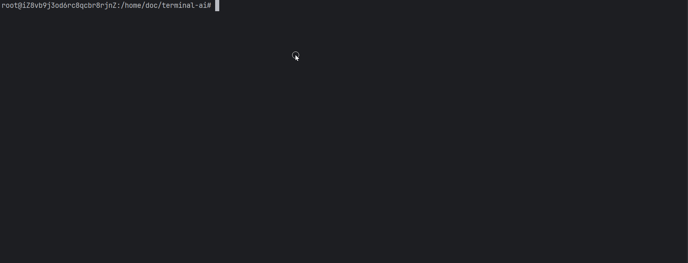

# Terminal Command Assistant

This project is a terminal-based command assistant that leverages GPT-4o to help you with your command-line needs. You can interact with it in two modes: explanation mode and command generation mode.



## Features

- **Explanation Mode**: Input your requirement prefixed with `#demand`, press `Enter`, and then `Ctrl+W` to receive an explanation from GPT-4o in a conversational format.
- **Command Generation Mode**: Input your requirement prefixed with `#demand`, press `Enter`, and then `Ctrl+G` to receive a command from GPT-4o. You will be prompted with the following options:
    - `[E]xecute`: Execute the generated command.
    - `[D]escribe`: Get a detailed description of what the command does.
    - `[A]bort`: Cancel the operation.

## Installation

To set up the project on your local server, follow these steps:

1. **Clone the Repository:**

    ```bash
    git clone <repository-url>
    ```

2. **Navigate to the Project Directory:**

    ```bash
    cd <project-directory>
    ```

3. **Set Your OpenAI API Key:**

   Run the `init.sh` file and input `YOUR_OPEN_API_KEY` with your actual OpenAI API key 

    ```bash
    chmod 777 init.sh
    ```

4. **Run the Initialization Script:**

    ```bash
    ./init.sh
    ```

## Usage

1. **Explanation Mode:**
    - Input your requirement prefixed with `#demand` and press `Enter`.
    - Press `Ctrl+W` to send the request to GPT-4o.
    - GPT-4o will respond in a conversational style, explaining the requirement.

2. **Command Generation Mode:**
    - Input your requirement prefixed with `#demand` and press `Enter`.
    - Press `Ctrl+G` to send the request to GPT-4o.
    - You will be prompted with the following options:
        - `[E]xecute`: Execute the generated command.
        - `[D]escribe`: Get a detailed description of what the command does.
        - `[A]bort`: Cancel the operation.

## Example

Here is a simple example to illustrate the usage:

1. **Requirement Input:**

    ```bash
    #Lists all the files in the current directory
    ```

2. **Explanation Mode:**
    - Press `Enter`, then `Ctrl+W`.
    - GPT-4o will respond with an explanation of how to list all files in the current directory.

3. **Command Generation Mode:**
    - Press `Enter`, then `Ctrl+G`.
    - GPT-4o will generate a command like `ls`.
    - You will be prompted to `[E]xecute`, `[D]escribe`, or `[A]bort`.

## Contributing

Contributions are welcome! Please fork the repository and submit a pull request.

## License

This project is licensed under the MIT License. See the [LICENSE](LICENSE) file for details.


---

Enjoy using your Terminal Command Assistant! 🚀